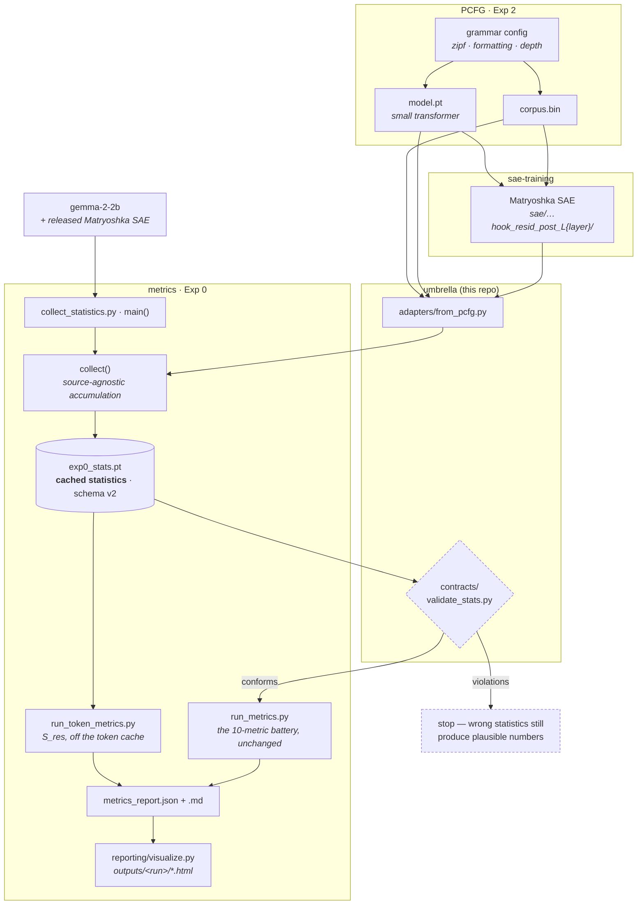

# SOAR I-6 — Does Structure Survive Scale?

Umbrella repository for the SOAR I-6 project: **diagnosing hierarchy in SAEs**.

Matryoshka SAEs, Temporal SAEs and Priors in Time all claim to recover hierarchical feature
dictionaries. None of them measures whether the parent→child structure is coherent — the claim is
usually checked with the weakest possible test, that the two features fire together. This project
builds the falsifiers, calibrates them where the answer is known, and applies them.

We audit these methods. We do not build a new architecture.

## Layout

```
soar-eleuther-i6-hierarchy/
├── metrics/            submodule — Exp 0: the metric battery          (metrics.git)
├── sae-training/       submodule — SAE training, toy / TinyStories / PCFG
├── PCFG/               submodule — Exp 2: corpora + base transformers  (PCFG.git)
│
├── contracts/          the cached-statistics contract + its validator
├── adapters/           SAE source → cached statistics   (the integration layer)
├── pipeline/           fetch runs off the node; turn graded runs into a table
├── research-log/       what we ran, what we learned, what broke
├── docker/             one image per sub-repo
└── compose.yaml        the three over one shared artifact volume
```

`contracts/` and `adapters/` live here rather than in a sub-repo because both are *about the
relationship between* the repos — no single one of them can own either. `research-log/` is
here for the same reason: a result produced by all three belongs to none of them.

## Clone

Submodules are pinned to exact commits; that pin is the reproduction anchor.

```bash
git clone --recurse-submodules https://github.com/soar-eleuther-i6-hierarchy/soar-eleuther-i6-hierarchy.git
# already cloned without it:
git submodule update --init
```

## The chain

One measurement, applied to SAEs from different sources. Everything converges on a
single object — the cached statistics — because every metric is a pure function over
it. That convergence is what makes a new source an *adapter* rather than a new metric.



The two seams. **PCFG → sae-training** is the run-directory layout: the SAE is written
*beside* the base model at `$PCFG_OUTPUT_ROOT/<experiment>/<hash>/sae/…`. **sae-training
→ metrics** is the adapter, and it was the project's open item until now — the metric
stages read the block structure from `metrics/config.py`, which hardcodes gemma's 32768
latents in 5 blocks, so a PCFG dictionary (1792 in 8) was sliced at the wrong
boundaries and still returned a full report.

That fix reached stages 01 and 02 first. Stages 03 and 04 kept the constant until 7 August,
which meant S_res — the strict test — could not run off gemma at all, and a dashboard built
from a PCFG cache would have drawn four plausible block pairs from the wrong feature columns
before raising on the fifth. Both now read the structure from the file they are grading, and
a non-gemma run publishes under its own name: `EXP0_RUN=pcfg` puts the pages at
`outputs/pcfg/layer_01/`, the same source/layer shape as gemma's. See [`research-log/ERROR_LOG.md`](research-log/ERROR_LOG.md).

The experiments are not parallel studies — they are a ladder trading ground truth against realism,
and each rung licenses the one above it:

| Source | Ground truth | What it alone establishes |
| --- | --- | --- |
| synthetic toy (Tier 1) | perfect — we built the tree | the metric is mathematically sound |
| trained toy (Tier 2 / Exp 1) | tree known, but the SAE must learn it | the metric survives a real training run |
| PCFG (Exp 2) | grammar known ⇒ hierarchy known, and **tunable** | the mechanism — sweep Zipfianness |
| TinyStories (Exp 3) | none | cross-method comparison |
| gemma-2-2b (Exp 4) | none | the claim that matters |

The headline is only worth what those rungs are worth. It has also changed: "94–99.9% of coverage
edges do not survive" was measuring candidate sets BOS had inflated, and after regeneration the
cheap filters accept most of what they see. What survives the correction is narrower — the
probe-based refinement test rejects **99.4%** of the edges that reach it (10 of 1,700 at layer 6,
the only layer it has run on), and multi-parenting is 89–100% across all five, so the graph is not
a tree. See [`research-log/ERROR_LOG.md`](research-log/ERROR_LOG.md).

## The contract that joins them

Every metric is a pure function over cached statistics, so a new SAE source needs an **adapter**,
not a new metric. [`contracts/stats_schema.md`](contracts/stats_schema.md) is the normative spec.

```bash
python3 contracts/validate_stats.py --self-test                     # spec vs. the synthetic toy
python3 contracts/validate_stats.py metrics/outputs/gemma2_2b/layer_06/exp0_stats.pt
```

The self-test asserts both directions: the spec accepts data known to be good, and rejects four
kinds of deliberate corruption. A validator that only ever passes is worthless.

## Running

Each sub-repo runs natively on the compute node via its own environment script — that is the path
the team uses day to day, and Docker does not replace it:

```bash
source PCFG/env.sh              # pcfg_bridge venv, PCFG_OUTPUT_ROOT, PCFG_SCRATCH
source sae-training/env_sae.sh  # separate venv, same storage/wandb conventions
```

To grade a run *off* the node, fetch it first. `data/` is gitignored and exists nowhere else —
the Hub dataset carries the five gemma layer caches only — so a fresh clone starts empty:

```bash
pipeline/fetch_pcfg_runs.sh <user>@<node> -n     # what it would move, and how much
pipeline/fetch_pcfg_runs.sh <user>@<node> zipf   # 81 MB: model, SAE, corpus prefix
```

It copies a *prefix* of the corpus (32 MB of ~382 MB): grading reads windows from the start
of the token stream and stops. That also fixes the window length, so runs graded from
different prefixes are not directly comparable — see the 7 August experiment-log entry.

Then the four stages, publishing under the run's own name:

```bash
export EXP0_RUN=pcfg/layer_01
python3 adapters/from_pcfg.py --run-dir data/pcfg-run --layer 1 --docs 3400 \
        --out metrics/outputs/pcfg/layer_01/exp0_stats.pt
cd metrics
python3 run_metrics.py --stats outputs/pcfg/layer_01/exp0_stats.pt --out-dir outputs/pcfg/layer_01
python3 run_token_metrics.py                      # S_res, off the token cache
python3 -m reporting.visualize                    # the dashboards
python3 -m reporting.layer_index --run            # the layer's index page
python3 -m reporting.layer_index --source pcfg    # the source's index page
```

The two environments are separate on purpose: `sae-training` requires Python ≥3.12 and
`pcfg_bridge` ≥3.10, and `sae_lens` / `transformer_lens` collide with the lean PCFG environment.

For reproducible runs and CI, [`docker/`](docker/) builds one image per sub-repo over one shared
artifact volume. See [`docker/README.md`](docker/README.md) for what those images can and cannot do.

## Status

| Piece | State |
| --- | --- |
| Exp 0 — metric battery | code complete; 10 metrics, 3 validation tiers + a control, 5 gemma layers, [published](https://soar-eleuther-i6-hierarchy.github.io/metrics/). **The findings are not** — see below |
| Exp 2 — PCFG pipeline | corpora + base-model training complete; 58 base models across four sweeps |
| Exp 2 — SAE side | Matryoshka complete and wired to the PCFG run layout |
| Metrics handoff | **done, and now all four stages** — [`adapters/from_pcfg.py`](adapters/from_pcfg.py) feeds a token cache and the run's own decoder, so S_res runs on PCFG too. First published non-gemma source: [`metrics/outputs/pcfg/`](metrics/outputs/pcfg/README.md) — zipf 1.5, 1792 latents in 8 blocks, layers 1 and 3 at 1,016,600 tokens each, metric code untouched |
| **Zipf axis** | **the blocker.** Base models exist at all six exponents; SAEs exist at `1.5` only. One point is not a curve |
| Exp 3 — cross-method | blocked: T-SAE's contrastive loss and Priors-in-Time's post-hoc clustering are unfinished |

The remaining blocker is data, not code. The cheapest thing that turns one point into a
result is the *other extreme* rather than the full sweep — an SAE at `zipf_exponent 0.0`,
whose base model is already trained and quality-checked.

### Exp 0 — what is still open after the BOS correction

The gemma results were regenerated on 6 August after BOS was found to be satisfying the
joint-support guard for every pair in the dictionary. Three of the four claims did not
survive; the full account is in [`research-log/ERROR_LOG.md`](research-log/ERROR_LOG.md),
entry `open`. What that leaves:

| Open item | State |
| --- | --- |
| **Tier-3 semantic reading** | **done, 7 Aug** — all 40 survivors (8 per layer × 5 layers, B0→B1) read against labels. About half are genuine refinement; the commonest failure is a semantic parent with a function-word or formatting child ("formal legal terminology" → the word "the"), which is topical co-occurrence — the one confound no metric here detects, and the one the synthetic toy now carries a negative control for. One reader, no protocol: a depth claim is **not** licensed by it |
| **Stage 03** (`run_token_metrics`) | run on **L6 only**. `run_metrics` labels its own sibling-redundancy figure `global_jaccard_confounded` and defers the verdict to stage 03 — so the published sibling number is the confounded one on four layers of five |
| ~~**In-block metric** (`in_block_edges`) never run~~ | **run on all seven graded runs** — five gemma layers and both PCFG layers, published as a sixth per-layer page. Same-level structure is a B0 phenomenon on both sources and is not explained by block size. Gemma carries **no S_res column** (the Hub has the stats cache, not the token cache), so those numbers are the entrance to the funnel: where the strict test did run, on PCFG layer 3, it took B0 from 888 edges to 7 |
| **The validator is not wired in** | `contracts/validate_stats.py` rejects a v1 cache, but nothing in the pipeline calls it. It sits in this repo, the pipeline sits in the submodule |
| **Two withdrawn pages** | `kill_rates.html` and `cross_depth_comparison.html` were hand-built with no generator and reported the fractions that inverted. Archived under `metrics/outputs_archive/` with a banner, not repaired. A cross-depth view should return only behind a generator |
| **Pages build is at its ceiling** | the last successful build took 10.6 min against a 10-minute limit, and the next one timed out before succeeding on retry. 10 MB of the 17 MB served is `feature_labels.json`, which no published page fetches — it is a build input, not a site asset. A `_config.yml` excluding it from the *site* (not from git) is the fix |

Nothing here blocks Exp 2. All of it blocks writing Exp 0 up.

Engineering still open, none of it blocking an experiment: `contracts/validate_run_dir.py`
for the artifact layout; `adapters/from_toy.py` and `from_tinystories.py`; a `pipeline/`
that runs the chain end to end in one command; dashboards for non-gemma sources
(`reporting/visualize.py` is built around gemma's block structure).

## Related

- **Project spec** — `SOAR I-6 Project Plan.md` (research question, Exp 0–5, timeline)
- **Paper workspace** — `paper-writing-collaboration/` (ICLR 2026 template, tagged references)
- **Exp 0 paper outline** — `metrics/`'s section outline, with the four claims and the open blockers
