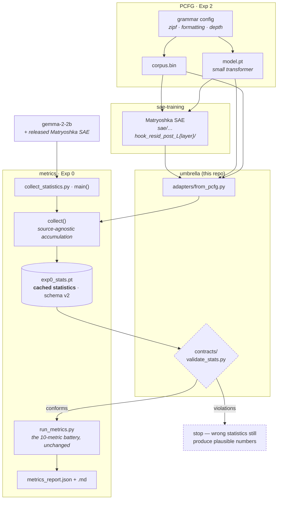

# SOAR I-6 — Does Structure Survive Scale?

Umbrella repository for the SOAR I-6 project: **diagnosing hierarchy in SAEs**.

Matryoshka SAEs, Temporal SAEs and Priors in Time all claim to recover hierarchical feature
dictionaries. None of them measures whether the parent→child structure is coherent — the claim is
usually checked with the weakest possible test, that the two features fire together. This project
builds the falsifiers, calibrates them where the answer is known, and applies them.

We audit these methods. We do not build a new architecture.

## Layout

```
soar-eleuther-i6-hierarchy/
├── metrics/            submodule — Exp 0: the metric battery          (metrics.git)
├── sae-training/       submodule — SAE training, toy / TinyStories / PCFG
├── PCFG/               submodule — Exp 2: corpora + base transformers  (PCFG.git)
│
├── contracts/          the cached-statistics contract + its validator
├── adapters/           SAE source → cached statistics   (the integration layer)
├── pipeline/           scripts that turn graded runs into a table
├── research-log/       what we ran, what we learned, what broke
├── docker/             one image per sub-repo
└── compose.yaml        the three over one shared artifact volume
```

`contracts/` and `adapters/` live here rather than in a sub-repo because both are *about the
relationship between* the repos — no single one of them can own either. `research-log/` is
here for the same reason: a result produced by all three belongs to none of them.

## Clone

Submodules are pinned to exact commits; that pin is the reproduction anchor.

```bash
git clone --recurse-submodules https://github.com/soar-eleuther-i6-hierarchy/soar-eleuther-i6-hierarchy.git
# already cloned without it:
git submodule update --init
```

## The chain

One measurement, applied to SAEs from different sources. Everything converges on a
single object — the cached statistics — because every metric is a pure function over
it. That convergence is what makes a new source an *adapter* rather than a new metric.



The two seams. **PCFG → sae-training** is the run-directory layout: the SAE is written
*beside* the base model at `$PCFG_OUTPUT_ROOT/<experiment>/<hash>/sae/…`. **sae-training
→ metrics** is the adapter, and it was the project's open item until now — the metric
stages read the block structure from `metrics/config.py`, which hardcodes gemma's 32768
latents in 5 blocks, so a PCFG dictionary (1792 in 8) was sliced at the wrong
boundaries and still returned a full report.

The experiments are not parallel studies — they are a ladder trading ground truth against realism,
and each rung licenses the one above it:

| Source | Ground truth | What it alone establishes |
| --- | --- | --- |
| synthetic toy (Tier 1) | perfect — we built the tree | the metric is mathematically sound |
| trained toy (Tier 2 / Exp 1) | tree known, but the SAE must learn it | the metric survives a real training run |
| PCFG (Exp 2) | grammar known ⇒ hierarchy known, and **tunable** | the mechanism — sweep Zipfianness |
| TinyStories (Exp 3) | none | cross-method comparison |
| gemma-2-2b (Exp 4) | none | the claim that matters |

The headline number — 94–99.9% of coverage edges do not survive — means something only because of
the rungs beneath it.

## The contract that joins them

Every metric is a pure function over cached statistics, so a new SAE source needs an **adapter**,
not a new metric. [`contracts/stats_schema.md`](contracts/stats_schema.md) is the normative spec.

```bash
python3 contracts/validate_stats.py --self-test                     # spec vs. the synthetic toy
python3 contracts/validate_stats.py metrics/outputs/layer_06/exp0_stats.pt
```

The self-test asserts both directions: the spec accepts data known to be good, and rejects four
kinds of deliberate corruption. A validator that only ever passes is worthless.

## Running

Each sub-repo runs natively on the compute node via its own environment script — that is the path
the team uses day to day, and Docker does not replace it:

```bash
source PCFG/env.sh              # pcfg_bridge venv, PCFG_OUTPUT_ROOT, PCFG_SCRATCH
source sae-training/env_sae.sh  # separate venv, same storage/wandb conventions
```

The two environments are separate on purpose: `sae-training` requires Python ≥3.12 and
`pcfg_bridge` ≥3.10, and `sae_lens` / `transformer_lens` collide with the lean PCFG environment.

For reproducible runs and CI, [`docker/`](docker/) builds one image per sub-repo over one shared
artifact volume. See [`docker/README.md`](docker/README.md) for what those images can and cannot do.

## Status

| Piece | State |
| --- | --- |
| Exp 0 — metric battery | complete; 10 metrics, 3 validation tiers + a control, 5 gemma layers, [published](https://soar-eleuther-i6-hierarchy.github.io/metrics/) |
| Exp 2 — PCFG pipeline | corpora + base-model training complete; 58 base models across four sweeps |
| Exp 2 — SAE side | Matryoshka complete and wired to the PCFG run layout |
| Metrics handoff | **done** — [`adapters/from_pcfg.py`](adapters/from_pcfg.py); both metric stages now take the block structure from the stats file. Verified end to end on a real run: a 1792-latent SAE in 8 blocks over 1.02M tokens, metric code untouched |
| **Zipf axis** | **the blocker.** Base models exist at all six exponents; SAEs exist at `1.5` only. One point is not a curve |
| Exp 3 — cross-method | blocked: T-SAE's contrastive loss and Priors-in-Time's post-hoc clustering are unfinished |

The remaining blocker is data, not code. The cheapest thing that turns one point into a
result is the *other extreme* rather than the full sweep — an SAE at `zipf_exponent 0.0`,
whose base model is already trained and quality-checked.

Engineering still open, none of it blocking an experiment: `contracts/validate_run_dir.py`
for the artifact layout; `adapters/from_toy.py` and `from_tinystories.py`; a `pipeline/`
that runs the chain end to end in one command; dashboards for non-gemma sources
(`reporting/visualize.py` is built around gemma's block structure).

## Related

- **Project spec** — `SOAR I-6 Project Plan.md` (research question, Exp 0–5, timeline)
- **Paper workspace** — `paper-writing-collaboration/` (ICLR 2026 template, tagged references)
- **Exp 0 paper outline** — `metrics/`'s section outline, with claims R1–R4 and the open blockers
